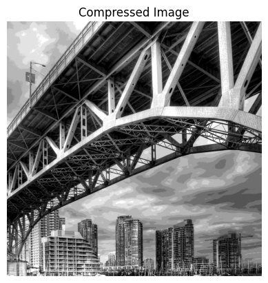
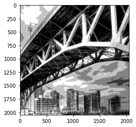
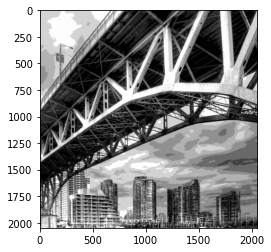

# ECE 592 Topics in Data Science
# Image-Compression

Implementing Hard and Soft Clustering Algorithms to compress image.

## Clustering Techniques (Unsupervised Learning):
  - Hard Clustering:
    - Built-in Kmeans 
    - Kmeans from scratch
  - Soft Clustering:
    - Fuzzy C means
    
## Steps:
  - Load Image and convert to gray scale
  - Clustering and Vector quantization of an image
  - Plot Rate vs Distortion
  - Vary Patch Size
  - Improve compression using entropy encoding
 
For detailed steps check HW8_2022.pdf

## Input Image

## Compressed Images

Builtin Kmeans           |  Scratch Kmeans |  Fuzzy C means
:-------------------------:|:-------------------------: |:-------------------------:
  |   | 
